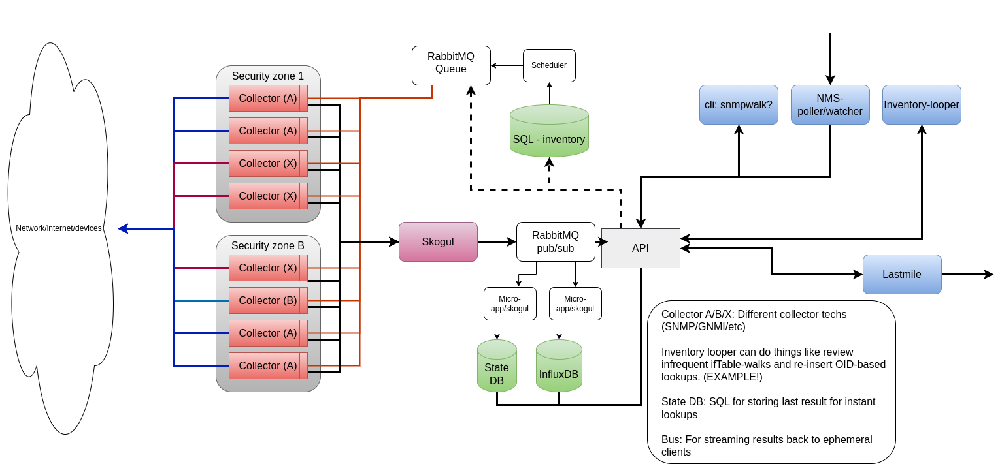

tpoll
=====

Tpoll is the beginning of a new framework for polling network devices.

It is currently able to:

- Poll a network device based on orders from a RabbitMQ queue
- Scale horizontally I suppose?
- Do "entity maps" to map ifIndex to names, including ahead of time
- Report back using Skogul ( https://github.com/telenornms/skogul )

The basic goal is to have a massively scalable solution that can be
dynamically configured at run-time, and ultimately handle ALL
information-requests to network devices, be it SNMP or GNMI or god knows
what.

The first iteration will focus on fundamentals and SNMP.

Basic design
------------

Design is subject to change, massively.

The basic concept is to have independent pollers that listen for tasks on a
queue. A locking service is needed too, but not (currently) shown. The
locking service is to prevent independent pollers from working on the same
device.

Each poller then uses Skogul to report back. This initial implementation
has Skogul embeded, thus an external one is not strictly speaking needed.

Results are streamed to a pub/sub-style exchange on RabbitMQ, and multiple
listeners can wait for it.

Each component is meant to be largely independent, and the design is meant
as a reference design where one need not implement all of it for it to be
useful. E.g.: You can get away with a simple poller, a shell script for
scheduler and skogul writing to influxDB directly if need be, using what
already exists today.
